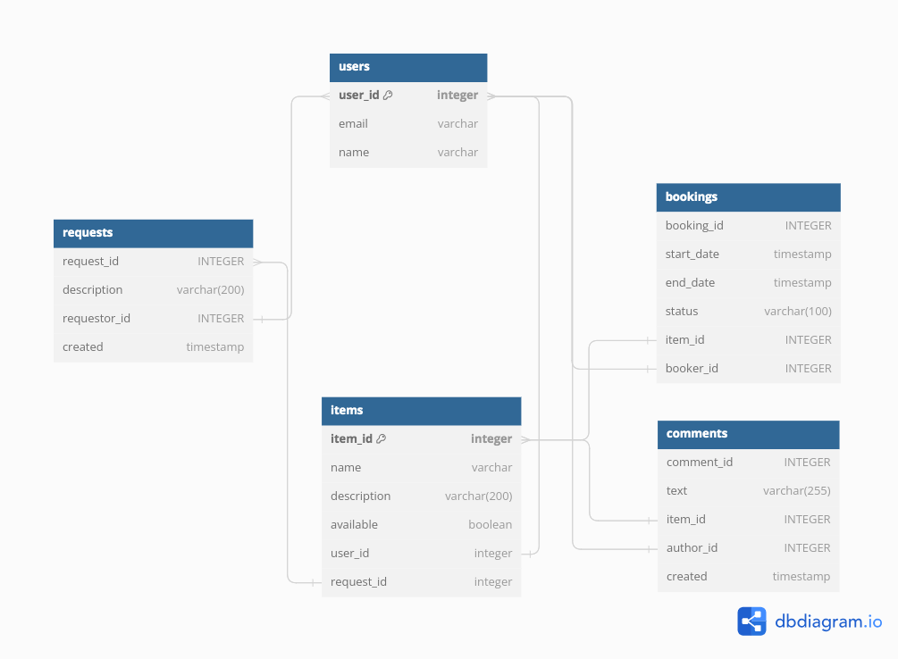

Template repository for Shareit project.

**Стек Технологий**: Java 11, Spring Boot, Maven, Hibernate, JPA, JUnit, Mockito, RESTful API, Lombok,  Docker, PostgreSQL;

**Приложение состоит из 2 сервисов:**

Gateway. Принимает запросы от пользователей и является своего рода шлюзом для валидации данных, распределяя нагрузку и направляет запросы дальше в основной сервис
Server. Серверная часть приложения, которая получает запросы, выполняет операции, отправляет данные клиенту.


**Функционал сервиса** позволяет бронировать вещи с возможностью выбрать определенные даты, и скрыть возможность бронирования данной вещи для других пользователей.
Сервис позволяет оставлять запросы пользователям в случае если желаемой вещи не нашлось или она занята, пользователь может добавить вещи на текущие запросы.
Данный сервис обеспечивает удобство и гибкость для пользователей и помогает им находить нужные вещи для временного использования, а так же добавлять свои вещи.
Реализована возможность оставлять отзывы, только после пользования данной вещью. На свои вещи отзывы оставлять запрещается

**Установка и запуск проекта**

Необходимо настроенная система виртуализации, установленный Docker Desktop(скачать и установить можно с официального сайта https://www.docker.com/products/docker-desktop/)

1. Клонируйте репозиторий проекта на свою локальную машину:
```git clone git@github.com:Romangolodyuk25/java-shareit.git```
2. Запустите коммандную строку и перейдите в коррень директории с проектом.
3. Соберите проект
```mvn clean package```
4. Введите следующую команду, которая подготовит и запустит приложение на вашей локальной машине
`````$  docker-compose up`````
5. Приложение будет запущено на порту 8080. Вы можете открыть свой веб-браузер и перейти по адресу http://localhost:8080,
чтобы получить доступ к приложению Share It.

_**Эндпоинты**_

* GET /users/{id} - получать пользователя по идентификатору
* GET /users/ - получать всех пользователей
* POST /users/ - добавлять пользователя в память
* PATCH /users/{id} - обновление пользователя по id
* DELETE /users/{id} - удаление пользователя по id
____
* POST /bookings/ - добавляет запрос на бронирование вещи.
* PATCH /bookings/{bookingId} - обновляет статус бронирования. Подтверждение или отклонение запроса на бронирование.
* GET /bookings/{bookingId} - получение данных о конкретном бронировании (включая его статус).
* GET /bookings?state={state} получение списка всех бронирований текущего пользователя.
* GET /bookings/owner?state={state} - получение списка бронирований для всех вещей текущего пользователя.
____
* GET /items/{id} - получать данные вещи по идентификатору
* GET /items/ - получать данные всех вещей
* POST /items/ - добавление вещи
* PATCH /items/{id} - обновление вещи по id
* DELETE /items/{id} - удаление вещи по id
* POST /items/{itemId}/comment - добавление отзывов на вещь
____
* POST /requests - добавить новый запрос вещи. Основная часть запроса — текст запроса, где пользователь описывает, какая именно вещь ему нужна
* GET /requests — получить список своих запросов вместе с данными об ответах на них.
* GET /requests/all?from={from}&size={size} — получить список запросов, созданных другими пользователями.
* GET/requests/{requestId} — получить данные об одном конкретном запросе вместе с данными об ответах на него в том же формате

**_Схема баз данных:_**
